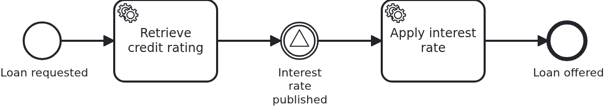
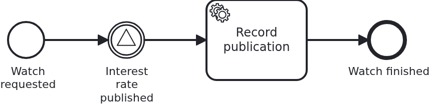

# Signals

[](./LICENSE)

Some news is not addressed to anybody. Today's interest rate is published, and every loan
approval waiting for it carries on - one, a dozen, or none, and the publisher knows nothing
about them. That is a signal, and this blueprint shows what it can and cannot do.

## What this blueprint shows



The loan approval of the base blueprint, waiting for the day's interest rate before the
offer is made. Three things are worth looking at:

- **The sender addresses nobody.** `Workflow#interestRatePublished` passes a name and
  nothing else - no aggregate, and there is no parameter for one. A signal reaches every
  element of the workflow module waiting for that name, and a caller cannot narrow that
  down. Reaching exactly one workflow is what `bpmn-message-correlation` is for.
- **A signal carries no data at all.** A message has at least the detour over the aggregate
  it is correlated for; a broadcast has no aggregate to write to. `Service` therefore stores
  the rate in its own table first, and the task behind the catch event reads it from there.
- **A signal is not buffered.** It reaches whoever waits at that moment. A loan approval
  arriving at the catch event a second later gets nothing and waits for the next
  publication. Where a delivery has to wait for its recipient, correlate a message instead.

### The scope is the workflow module, not the process



A second process in the same workflow module, and it does nothing else: it starts, waits
for `InterestRatePublished` and records that the signal arrived. It belongs to a use case of
its own, `ratewatch`, with its own aggregate, its own API and no line of code shared with
the loan approval.

One broadcast reaches both processes. That is what "a signal is broadcast per workflow
module" means, and it is easy to get wrong in either direction: nobody has to send the
signal once per process, and nobody can keep it inside the process that sent it. What the
broadcast does not cross is the workflow module. Another module is a scope of its own, and
an application that wants the signal there sends it through the `ProcessService` of that
module as well.

`RateWatchIT` is the test of that claim: the rate watch waits, the loan approval use case
publishes a rate, and the watch continues.

Two things this blueprint deliberately does not show, and where to find them:

- **A signal that starts a workflow**, which belongs to `bpmn-bpms-initiated-start`: nobody
  created an aggregate beforehand there, and the application learns of the start through a
  hook rather than triggering it.
- **A signal throw event inside the model.** That is one process telling itself something
  and needs no line of Java, so there is nothing for a blueprint to explain.

## Delta to the base blueprint

Compared to [`module-single`](https://github.com/vanillabp-blueprints/module-single-springboot):

|         File          |                                     What is different                                      |
|-----------------------|--------------------------------------------------------------------------------------------|
| `loan_approval.bpmn`  | a signal catch event the workflow waits at, and a service task behind it                   |
| `Workflow.java`       | `sendSignal`, plus the signal name as a constant                                           |
| `Service.java`        | stores the published rate, then broadcasts; reads the rate again when a workflow continues |
| `ApiController.java`  | the endpoint publishing the rate - the only one without a loan request id in its path      |
| `InterestRate.java`   | the published rate, application data belonging to no workflow                              |
| `Aggregate.java`      | `interestRate`, which is where the rate ends up per loan approval                          |
| `LoanApprovalIT.java` | waiting, one broadcast continuing two workflows, and a signal nobody caught                |
| `ratewatch/`          | a second use case, whose process waits for the same signal                                 |
| `rate_watch.bpmn`     | that process: start, catch the signal, record it                                           |
| `RateWatchIT.java`    | the broadcast of one use case reaching the process of the other                            |

## Running it

Requires a JDK 21. Camunda 7 is embedded, so nothing else has to run:

```bash
mvn install verify
```

Running it on another BPMS is a Maven profile, not one line of Java changes:

```bash
mvn install verify -Pcamunda8
```

Camunda 8 is a remote engine, so a cluster has to run. Start one; its address, and everything
else specific to that engine, lives in its profile file
`application/src/main/resources/application-camunda8.yaml`, with a copy for the module's own
test:

```yaml
vanillabp:
  adapters:
    camunda8:
      # Camunda 8 is a remote engine: point this at your cluster.
      rest-address: http://localhost:8080
```

That file is loaded because the Maven profile `camunda8` sets the Spring profile of the same
name, so the engine is chosen once, on the Maven command line, and the build, the tests and
`spring-boot:run` all follow it.

Start the application:

```bash
mvn -pl application spring-boot:run
```

Booting logs a warning per workflow module: both Camunda adapters start out with
`name-clash-avoidance: none`, so nothing keeps the identifiers of one workflow module apart
from those of another, and the adapter asks for a decision instead of picking one. One module
cannot collide with itself, so this blueprint leaves it at that. Answering the question is one
property, `vanillabp.adapters.<id>.accept-unscoped-identifiers: true`, and the modes a BPMS
offers are in
[the wiki](https://github.com/vanillabp/adapter-platform-integration/wiki/Workflow-modules#how-name-clashes-are-avoided).

Start a loan approval. This is the only URL you need:

```
http://localhost:8080/api/loan-approval/start?amount=5000
```

The process rates the request and then waits. What it logs is the URL publishing the rate:

```
Loan approval '0f7c…' started
Credit rating of loan approval '0f7c…' is 50. The workflow now waits for today's interest rate, and so does every other loan approval which got this far:
  Publish -> http://localhost:8080/api/loan-approval/publish-interest-rate?rate=3.5
```

Start a second and a third loan approval before opening that URL. One broadcast continues
all of them:

```
An interest rate of 3.5% was published. Every loan approval waiting for it continues
Loan approval '0f7c…' is offered at 3.5%
Loan approval '91ab…' is offered at 3.5%
Loan approval '4d20…' is offered at 3.5%
```

Now start another loan approval and watch it wait, although the rate has been published:
the signal is gone, and only the next publication reaches it. That is the property to
remember before choosing a signal over a message.

The rate watch is started at a URL of its own and waits for the same signal:

```
http://localhost:8080/api/rate-watch/start
```

Publish a rate while both a loan approval and a rate watch are waiting, and one call
continues both:

```
An interest rate of 3.5% was published. Every loan approval waiting for it continues
Loan approval '0f7c…' is offered at 3.5%
Rate watch '7b31…' noticed the publication, although the broadcast was sent by the loan approval use case
```

While the application runs on Camunda 7, Camunda's own web applications are served at

```
http://localhost:8080/camunda
```

Log in with `demo` / `demo`. Cockpit shows every instance standing at the signal event,
which is the quickest way to see who a broadcast is about to reach. The user comes from
`application/src/main/resources/application-camunda7.yaml` and exists so that the
blueprint can be operated without setting one up; an application with an identity provider
of its own leaves that section out.

The Camunda 8 profile brings neither the dependency nor those settings into effect. Its
tooling is part of the cluster, and the file naming a Camunda 7 adapter id is simply not
loaded there - a profile file applies to its own engine and to no other. Naming an adapter
id whose adapter is not on the classpath is a configuration error VanillaBP refuses to
start with, and the profiles are what keeps that from happening.

## How it works

|                                          File                                          |                                            Role                                            |
|----------------------------------------------------------------------------------------|--------------------------------------------------------------------------------------------|
| `loan-approval/src/main/resources/loan-approval/processes/camunda7/loan_approval.bpmn` | the process: a signal catch event naming `InterestRatePublished`, a service task behind it |
| `.../loanapproval/Service.java`                                                        | stores the rate, broadcasts, and reads the rate again for each workflow that continues     |
| `.../loanapproval/Workflow.java`                                                       | `sendSignal`, the only place `ProcessService` is used                                      |
| `.../loanapproval/ApiController.java`                                                  | the endpoint publishing the rate, addressed to no business case                            |
| `.../loanapproval/model/InterestRate.java`                                             | the published rate: application data, not a workflow aggregate                             |
| `.../loanapproval/model/Aggregate.java`                                                | `interestRate`: what the workflow read after the signal reached it                         |
| `loan-approval/src/test/.../LoanApprovalIT.java`                                       | waiting, one broadcast for two workflows, and a signal nobody caught                       |

The order of events: the service task fills in the rating, the BPMS reaches the catch event
and the workflow stops there, together with every other loan approval that got this far.
Whenever the rate is published, `ApiController` calls `Service#publishInterestRate`, which
saves the rate and then tells `Workflow` what happened.
`Workflow#interestRatePublished` calls `ProcessService#sendSignal` with the signal name, in
a transaction: on a remote BPMS the broadcast is sent only after that transaction committed,
so a rollback takes it with it - and the rate is stored by then, which is what the
continuing workflows are about to read.

The broadcast is scoped to the workflow module of that `ProcessService`. It reaches every
BPMS the module is deployed to, which is what keeps it complete while workflows are being
migrated from one BPMS to another, and it does not cross into other workflow modules. An
application wanting a signal in several modules sends it through the `ProcessService` of
each of them: which modules are meant is a business question, and VanillaBP does not answer
it for you.

The test broadcasts repeatedly rather than once, and the reason is the property this
blueprint is about. The credit rating being written proves the service task ran, not that
the subscription of the catch event behind it already exists - on a remote engine those are
two transactions, and a signal falling into that gap is gone. Repeating is harmless: a
signal nobody waits for reaches nobody.

## Documentation

- [Workflow modules](https://github.com/vanillabp/adapter-platform-integration/wiki/Workflow-modules): the scope a broadcast covers, and how identifiers are kept apart between modules
- [Message correlation](https://github.com/vanillabp/adapter-platform-integration/wiki/Message-correlation): the addressed counterpart, for news meant for one workflow
- [Workflow aggregates](https://github.com/vanillabp/adapter-platform-integration/wiki/Workflow-aggregates): why data a workflow needs lives in your own tables and not in the BPMS
- the wiki of the [BPMS adapter](https://github.com/vanillabp/adapter-platform-integration/wiki/BPMS-adapters) you use: what its engine does with a broadcast

This blueprint is developed in the monorepo
[`blueprints`](https://github.com/vanillabp-blueprints/blueprints). This repository is a
read-only mirror, **issues and pull requests belong there.**

## Noteworthy & Contributors

[VanillaBP](https://www.github.com/vanillabp/spi-for-java) was developed by [Phactum](https://www.phactum.at) with the
intention of giving back to the community as it has benefited the community in the past.


## License

Copyright 2026 Phactum Softwareentwicklung GmbH

Licensed under the Apache License, Version 2.0
